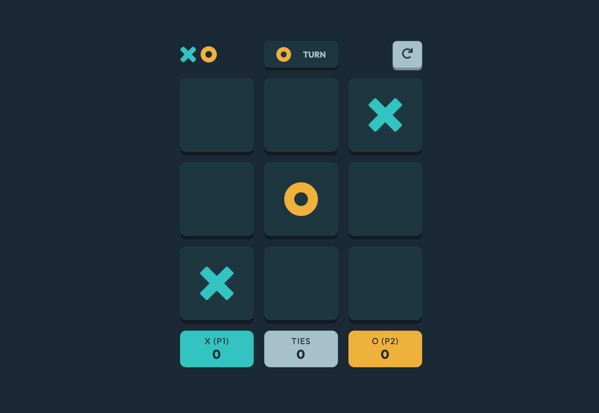

# The Odin Project - Tic Tac Toe

This is a solution to the [Tic Tac Toe challenge from the Odin Project](https://www.theodinproject.com/lessons/node-path-javascript-tic-tac-toe).

## Overview

### The challenge

To build the core logic using factory functions and closures.

### Links

- Solution on: [GitHub](https://github.com/sydalwedaie/odin-project-tic-tac-toe)
- Live Site on: [Netlify](https://odin-project-tic-tac-toe-9hrue.netlify.app/)

## What I learned

- My first attempt at trying to build using MVC architecture.
- Before rendering, I need to fetch the new state everytime I do an action.
- HTML `dialog` element has an inline-margin I could not remove. I fixed it with `max-width: none`.
- Hidden HTML elements would appear if their display is set to `flex`. Use this to fix:

```css
[hidden] {
    display: none !important; /* prevent flex override */
}
```
